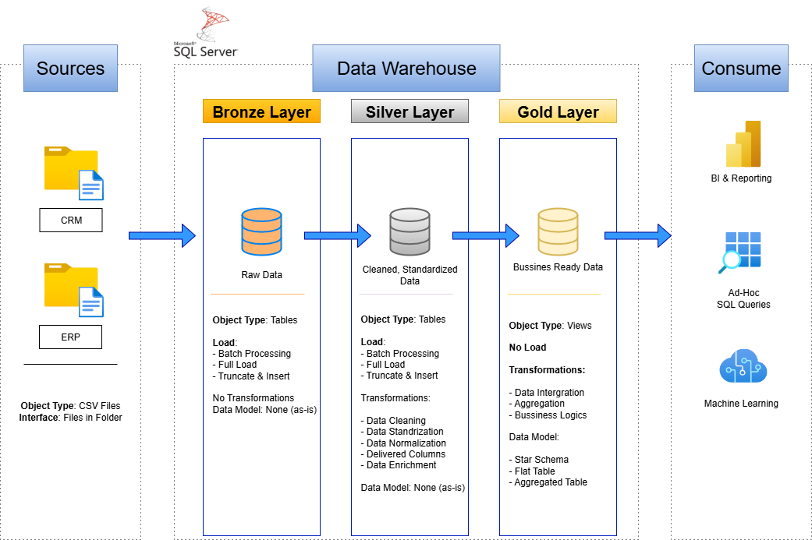
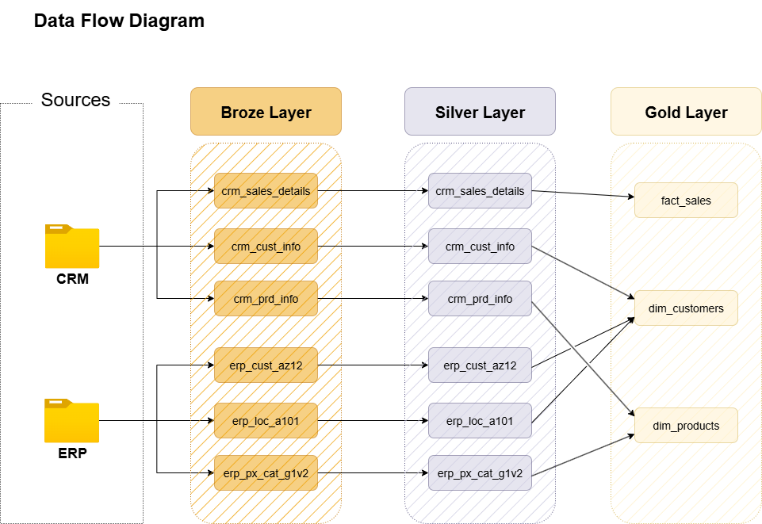
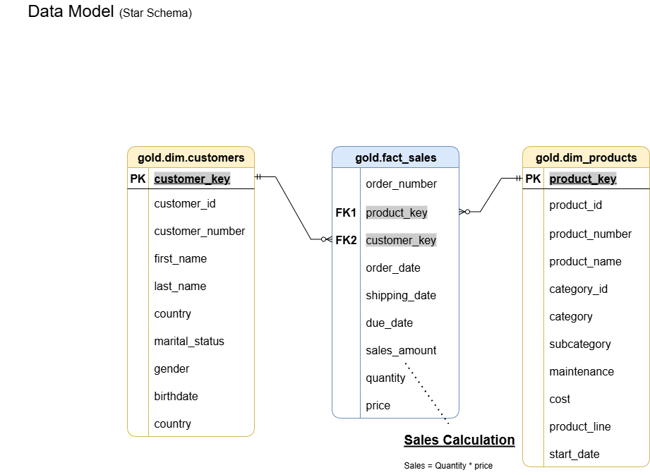

# Sales Data Warehouse Project

## 📘 Project Overview
This project is a **learning-oriented data warehouse** built to simulate real-world data engineering and analytics workflows.  
The main goal is to design and implement a **Sales Data Warehouse** using the **Bronze–Silver–Gold architecture**, perform ETL transformations, and prepare the data for future visualization in Power BI.

The project follows the structure and guidance from **Data with Baraa**, but all steps were implemented independently for learning and portfolio purposes.

---
## Project Objectives

✅ Consolidate sales data from multiple source systems (ERP + CRM)  
✅ Cleanse and resolve data quality issues through automated validation  
✅ Create a user-friendly star schema dimensional model for analytics  
✅ Enable analytical reporting and informed decision-making  
✅ Prepare data for Power BI dashboard development  
✅ Focus on current snapshot (no historization required)  

## ⚙️ Technologies Used
- **SQL Server (T-SQL)** – main environment for data transformation and querying  
- **Bulk Insert** – for importing raw CSV files into the Bronze layer  
- **Draw.io** – for designing ERD and architecture diagrams  
- **Notion** – for project planning and progress tracking  
- **Excel / CSV** – data sources  
- *(Upcoming)* Power BI – for building dashboards and data visualization  

---

## 🧱 Project Architecture

The data warehouse follows the **Medallion Architecture** pattern:

| Layer | Description | Example Tables |
|--------|--------------|----------------|
| **Bronze** | Raw data loaded directly from CSV files without transformation. | `bronze_sales`, `bronze_customers`, `bronze_products` |
| **Silver** | Cleaned and standardized data. Includes handling nulls, fixing data types, and standardizing formats. | `silver_sales`, `silver_customers`, `silver_products` |
| **Gold** | Final analytical tables ready for reporting and dashboards (fact and dimension tables). | `fact_sales`, `dim_customers`, `dim_products`, `dim_dates` |

### Layer Descriptions  
🥉 Bronze Layer - Raw Data Storage  

**Purpose:** Store raw data exactly as received from source CSV files  
**Method:** Direct BULK INSERT operations  
**Processing:** None - preserves original data format and structure  
**Implementation:** Physical tables  
**Procedure:** bronze.load_bronze  

🥈 Silver Layer - Cleaned & Standardized  

**Purpose:** Clean, validate, and standardize data for consistency
**Transformations Applied:**  

- Trimming whitespace from string fields  
- Standardizing categorical values (marital_status, gender, country, product_line)  
- Date validation, formatting, and conversion  
- Removing duplicate records  
- Handling NULL values appropriately  
- Data type conversions and casting  
- Business rule validations (e.g., sales = quantity × price)  
- Data enrichment (e.g., calculating end dates using LEAD function)  
- Value mapping (e.g., 'M' → 'Mountain', 'R' → 'Road')  


**Implementation:** Physical tables  
**Procedure:** silver.load_silver  

🥇 Gold Layer - Business-Ready Analytics  

**Purpose:** Dimensional model optimized for analytical queries and BI tools  
**Design:** Star schema with fact and dimension tables  
**Implementation:** Views (created on top of Silver layer)  
**Features:**  

- Surrogate keys generated using ROW_NUMBER() function  
- Denormalized structure for query performance  
- Business-friendly column names  
- Referential integrity validated  
- Optimized for Power BI consumption  

You can visualise the structure in the diagram below.  


---

## 🔄 ETL Process

1. **Extract** – CSV files are imported into SQL Server using `BULK INSERT` commands.  
2. **Transform** – Data cleaning and transformation scripts run in the Silver layer:
   - Remove duplicates and null values  
   - Standardize data types and formats  
   - Create surrogate keys  
3. **Load** – Gold layer aggregates data into fact and dimension tables for analytical use.




## 🧩 Data Model (Star Schema)

The Gold layer follows a Star Schema structure consisting of:
- **Fact Table:** fact_sales
- **Dimension Tables:** dim_customers, dim_products
This schema enables efficient analytical queries and reporting in BI tools.



## Key Design Decisions  
### Surrogate Key Generation
```sql
-- Example: Creating surrogate keys using ROW_NUMBER()
ROW_NUMBER() OVER (ORDER BY customer_id) AS customer_key
```
### Views vs Tables in Gold Layer  

Gold layer uses views rather than physical tables.  
**Benefits:**

  - Always reflects current Silver layer data  
  - No need for separate Gold ETL procedure  
  - Simplified maintenance  
  - Reduced storage requirements  
  - Real-time data availability  

### Table Relationships:

One-to-Many: dim_products (1) → fact_sales (*)  
One-to-Many: dim_customers (1) → fact_sales (*)

## 🚀 Next Steps  

The next stage of this learning project will include:  

Building a Power BI dashboard connected to the Gold layer  

Performing business analysis and generating insights from sales performance data  

## 👤 Author & Credits

Author: Vladimír Šíp  
Based on learning project by: Data with Baraa  
Purpose: Educational project for practicing SQL, data modeling, and ETL concepts.  

